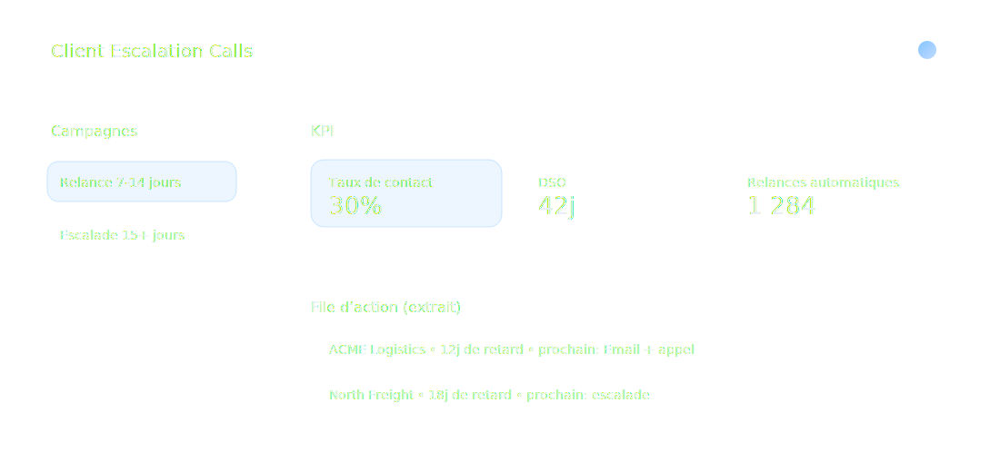
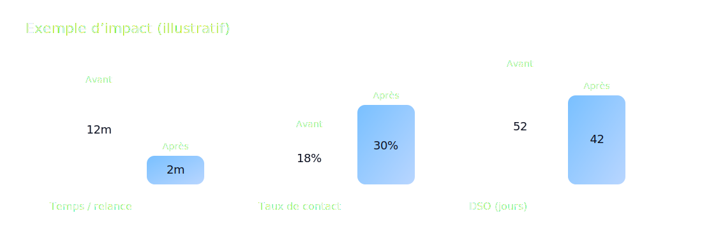

# Client Escalation Calls
## Automatisation intelligente des relances (Email + Téléphone)

**Objectif :** réduire le DSO, augmenter le taux de recouvrement, et libérer vos équipes.

---

# Votre réalité aujourd’hui

| Problème | Impact business |
|---|---|
| Relances manuelles, chronophages | Coûts élevés + faible scalabilité |
| Incohérence des messages (tons, délais) | Baisse de conversion + image de marque |
| Données dispersées (CRM, Email, Téléphonie) | Manque de suivi et de priorisation |
| Faible visibilité sur la performance | Décisions difficiles (pas de KPI fiables) |

---

# Notre solution

## Une plateforme agentique de recouvrement

### Ce que ça fait

- Priorise les comptes à relancer
- Envoie des emails adaptés au contexte
- Lance des appels sortants (Twilio)
- Trace chaque tentative & résultat
- Mesure la performance (KPI, SLA)

---

# Ce que vos équipes obtiennent

### Automatisation

- Moins de tâches répétitives
- Cadence régulière
- Exécution 24/7

### Gouvernance

- Règles de conformité
- Contrôles d’accès
- Historique traçable

### Pilotage

- Tableaux de bord
- KPI par campagne
- Amélioration continue

---

# Fonctionnalités clés

| Domaine | Capacités |
|---|---|
| Orchestration | Campagnes, règles, priorisation, escalade |
| Email | Templates, personnalisation, suivi, réponses |
| Téléphone | Appels sortants, scripts, journalisation |
| CRM | Synchronisation comptes, statuts, notes |
| Sécurité | Auth, autorisation, rate limiting, audit |
| Observabilité | Logs structurés, métriques, alerting |

---

# Différenciation

| Approche | Classique (scripts / call-center) | Client Escalation Calls |
|---|---:|---:|
| Personnalisation | Faible | Élevée (contexte + règles) |
| Scalabilité | Limitée par l’humain | Agents + workflows |
| Traçabilité | Fragmentée | Historique unifié |
| Pilotage KPI | Partiel | Natif (campagnes, SLA, conversion) |
| Time-to-value | Semaines / mois | Rapide (intégrations ciblées) |

---

# Architecture (haut niveau)

- API Gateway (exposition contrôlée)
- Agents (coordination, email, téléphone)
- Moteurs (workflow, règles, conformité)
- Stockage & audit (DB + journaux)

---

# Exemple de KPI & ROI

| KPI | Avant | Après (cible) |
|---|---:|---:|
| Temps moyen par relance | 12 min | 2 min |
| Taux de contact | 18% | 30% |
| DSO | 52 jours | 42 jours |

---

# Sécurité & conformité

### Contrôles

- Authentification & rôles
- Limitation de débit (anti-abus)
- Journalisation et audit

### Bonnes pratiques

- Principe du moindre privilège
- Traçabilité des actions
- Ségrégation des environnements

---

# Parcours de déploiement

| Étape | Délai typique | Livrable |
|---|---:|---|
| Cadrage (process + KPI) | 2-3 jours | Plan de campagne + règles |
| Intégration CRM / Email / Téléphonie | 1-2 semaines | Connecteurs + mapping |
| Pilote (1 segment clients) | 1-2 semaines | Mesure KPI + itérations |
| Généralisation | 2-4 semaines | Runbook + scaling |

---

# Offres (à adapter)

| Offre | Pour qui | Inclut |
|---|---|---|
| Starter | 1 équipe / 1 périmètre | Workflows de base + dashboards |
| Pro | Plusieurs segments | A/B templates + règles avancées |
| Enterprise | Multi-pays / multi-équipes | SSO, audit renforcé, SLA, support |

---

# Prochaine étape

## Atelier 60 minutes

- Cartographier votre process de relance
- Définir 3 KPI (ex: DSO, taux de contact, conversion)
- Identifier les intégrations nécessaires
- Démonstration sur un scénario réel

**À la fin :** un plan d’implémentation et une estimation.
